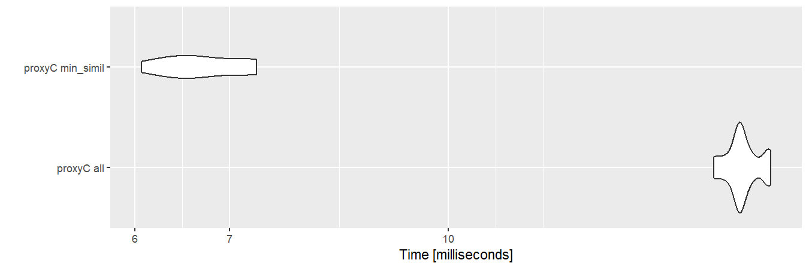
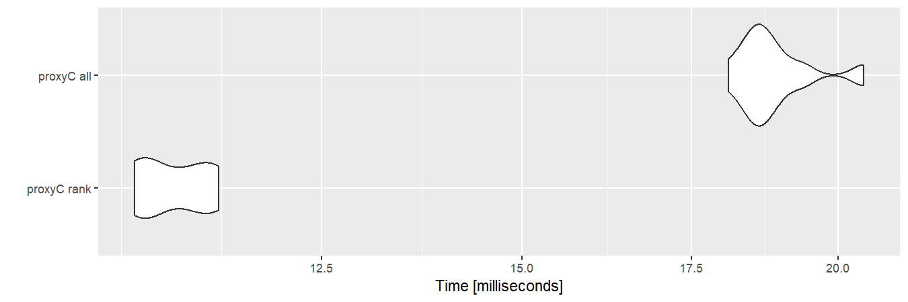

# proxyC: R package for large-scale similarity/distance computation

<!-- badges: start -->

[](https://CRAN.R-project.org/package=proxyC)
[](https://CRAN.R-project.org/package=proxyC)
[](https://CRAN.R-project.org/package=proxyC)
[](https://github.com/koheiw/proxyC/actions)
[](https://app.codecov.io/gh/koheiw/proxyC)
<!-- badges: end -->

**proxyC** computes proximity between rows or columns of large matrices
efficiently in C++. It is optimized for large sparse matrices using the
Armadillo and Intel TBB libraries. Among several built-in
similarity/distance measures, computation of correlation, cosine
similarity and Euclidean distance is particularly fast.

This code was originally written for
[**quanteda**](https://github.com/quanteda/quanteda) to compute
similarity/distance between documents or features in large corpora, but
separated as a stand-alone package to make it available for broader data
scientific purposes.

## Install

Since **proxyC** v0.4.0, it requires the Intel oneAPI Threading Building
Blocks for parallel computing. Windows and Mac users can download a
binary package from CRAN, but Linux users must install the library by
executing the commands below:

``` bash
# Fedora, CentOS, RHEL
sudo yum install tbb-devel

# Debian and Ubuntu
sudo apt install libtbb-dev
```

``` r
install.packages("proxyC")
```

## Performance

``` r
require(Matrix)
## Loading required package: Matrix
require(microbenchmark)
## Loading required package: microbenchmark
require(ggplot2)
## Loading required package: ggplot2
require(magrittr)
## Loading required package: magrittr

# Set number of threads
options("proxyC.threads" = 8)

# Make a matrix with 99% zeros
sm1k <- rsparsematrix(1000, 1000, 0.01) # 1,000 columns
sm10k <- rsparsematrix(1000, 10000, 0.01) # 10,000 columns

# Convert to dense format
dm1k <- as.matrix(sm1k) 
dm10k <- as.matrix(sm10k)
```

## Cosine similarity between columns

With sparse matrices, **proxyC** is roughly 10 to 100 times faster than
**proxy**.

``` r
bm1 <- microbenchmark(
    "proxy 1k" = proxy::simil(dm1k, method = "cosine"),
    "proxyC 1k" = proxyC::simil(sm1k, margin = 2, method = "cosine"),
    "proxy 10k" = proxy::simil(dm10k, method = "cosine"),
    "proxyC 10k" = proxyC::simil(sm10k, margin = 2, method = "cosine"),
    times = 10
)
autoplot(bm1)
```

<!-- -->

## Cosine similarity greater than 0.9

If `min_simil` is used, **proxyC** becomes even faster because small
similarity scores are floored to zero.

``` r
bm2 <- microbenchmark(
    "proxyC all" = proxyC::simil(sm1k, margin = 2, method = "cosine"),
    "proxyC min_simil" = proxyC::simil(sm1k, margin = 2, method = "cosine", min_simil = 0.9),
    times = 10
)
autoplot(bm2)
```

<!-- -->

Flooring by `min_simil` makes the resulting object much smaller.

``` r
proxyC::simil(sm10k, margin = 2, method = "cosine") %>% 
  object.size() %>% 
  print(units = "MB")
## 763 Mb
proxyC::simil(sm10k, margin = 2, method = "cosine", min_simil = 0.9) %>% 
  object.size() %>% 
  print(units = "MB")
## 0.2 Mb
```

## Top-10 correlation

If `rank` is used, **proxyC** only returns top-n values.

``` r
bm3 <- microbenchmark(
    "proxyC rank" = proxyC::simil(sm1k, margin = 2, method = "correlation", rank = 10),
    "proxyC all" = proxyC::simil(sm1k, margin = 2, method = "correlation"),
    times = 10
)
autoplot(bm3)
```

<!-- -->
