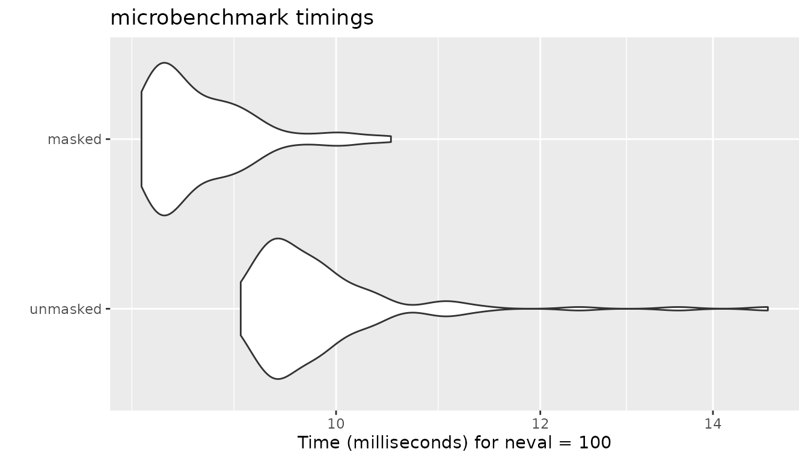
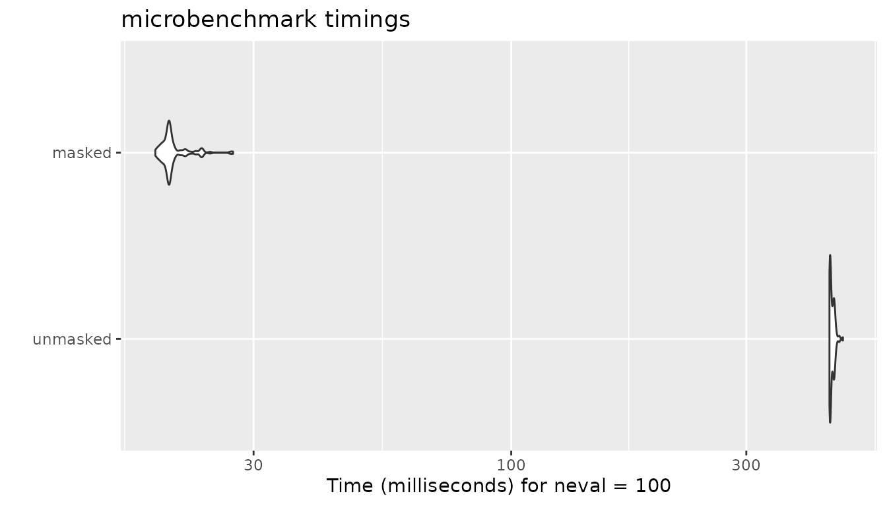

# Masked Similarity Computation

**proxyC** v0.5 introduces masked similarity (or distance) computation
to improve the execution time and memory usage. In the toy example, we
compute similarity only between column vectors in `mt1` and `mt2` with
the same alphabetical names, leaving all others `Nan`. We can achieve
this by creating a pattern matrix `msk` using
[`mask()`](https://koheiw.github.io/proxyC/reference/mask.md) and
passing it to
[`simil()`](https://koheiw.github.io/proxyC/reference/simil.md) (or
[`dist()`](https://koheiw.github.io/proxyC/reference/simil.md)).

## Example

``` r
library(proxyC)
library(Matrix)

mt1 <- rsparsematrix(100, 6, 1.0)
colnames(mt1) <- c("a", "a", "d", "d", "e", "e")
mt2 <- rsparsematrix(100, 5, 1.0)
colnames(mt2) <- c("a", "b", "c", "d", "e")

(msk <- mask(colnames(mt1), colnames(mt2)))
#> 6 x 5 sparse Matrix of class "lgTMatrix"
#>   a b c d e
#> a | . . . .
#> a | . . . .
#> d . . . | .
#> d . . . | .
#> e . . . . |
#> e . . . . |
```

``` r
(sim <- simil(mt1, mt2, margin = 2, method = "cosine", mask = msk, use_nan = TRUE))
#> 6 x 5 sparse Matrix of class "dgTMatrix"
#>             a   b   c           d           e
#> a  0.10463988 NaN NaN         NaN         NaN
#> a -0.09258201 NaN NaN         NaN         NaN
#> d         NaN NaN NaN -0.06961173         NaN
#> d         NaN NaN NaN -0.07654895         NaN
#> e         NaN NaN NaN         NaN -0.03211685
#> e         NaN NaN NaN         NaN  0.07722747
```

## Execution Times

With large matrices, we can measures the impact of masked similarity
computation.

``` r
library(microbenchmark)
library(ggplot2)

mt1 <- rsparsematrix(1000L, 2600L, 0.1)
colnames(mt1) <- rep(letters, each = 100L)
mt2 <- rsparsematrix(1000L, 26L, 0.1)
colnames(mt2) <- letters
msk <- mask(colnames(mt1), colnames(mt2))
```

### Cosine Similarity

The impact of masking is limited in cosine similarity because **proxyC**
employs linear algebra extensively. It computes all the similarity
scores but saves values for only unmasked pairs if `method` is either
“cosine”, “correlation” or “euclidean”.

``` r
bm <- microbenchmark(
    unmasked = simil(mt1, mt2, margin = 2, method = "cosine", mask = NULL, drop0 = TRUE),
    masked = simil(mt1, mt2, margin = 2, method = "cosine", mask = msk, drop0 = TRUE)
)

autoplot(bm)
#> Warning: `aes_string()` was deprecated in ggplot2 3.0.0.
#> ℹ Please use tidy evaluation idioms with `aes()`.
#> ℹ See also `vignette("ggplot2-in-packages")` for more information.
#> ℹ The deprecated feature was likely used in the microbenchmark package.
#>   Please report the issue at
#>   <https://github.com/joshuaulrich/microbenchmark/issues/>.
#> This warning is displayed once every 8 hours.
#> Call `lifecycle::last_lifecycle_warnings()` to see where this warning was
#> generated.
```



### Jaccard Similarity

Masking has the greatest impact on the execution time in other methods
because **proxyC** computes and saves Jaccard similarity scores only for
unmasked pairs. We expect to see similar performance improvement in
ejaccard”, “fjaccard”, “edice”, “hamann”, “faith” and”simple matching”.

``` r
bm <- microbenchmark(
    unmasked = simil(mt1, mt2, margin = 2, method = "jaccard", mask = NULL, drop0 = TRUE),
    masked = simil(mt1, mt2, margin = 2, method = "jaccard", mask = msk, drop0 = TRUE)
)

autoplot(bm)
```



## Object Sizes

Masking also dramatically reduces the sizes of similarity matrices when
`use_nan = FALSE`.

``` r
sim_um <- simil(mt1, mt2, margin = 2, method = "cosine", mask = NULL, use_nan = FALSE)
sim_mk <- simil(mt1, mt2, margin = 2, method = "cosine", mask = msk, use_nan = FALSE)

print(object.size(sim_um), unit = "KB")
#> 1081.2 Kb
print(object.size(sim_mk), unit = "KB")
#> 65.5 Kb
```
