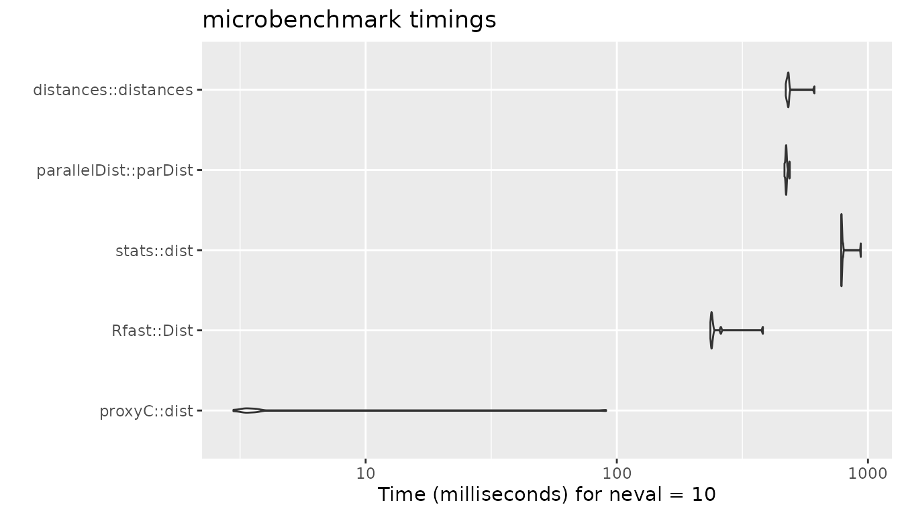
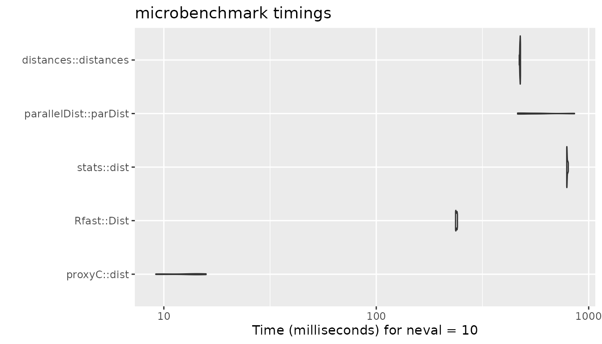
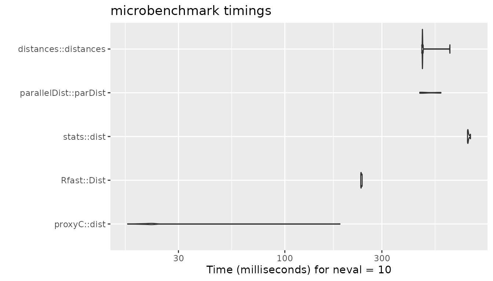
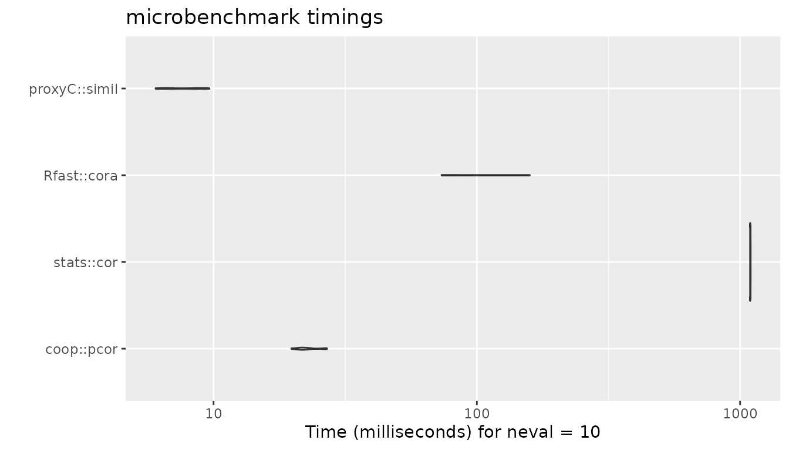
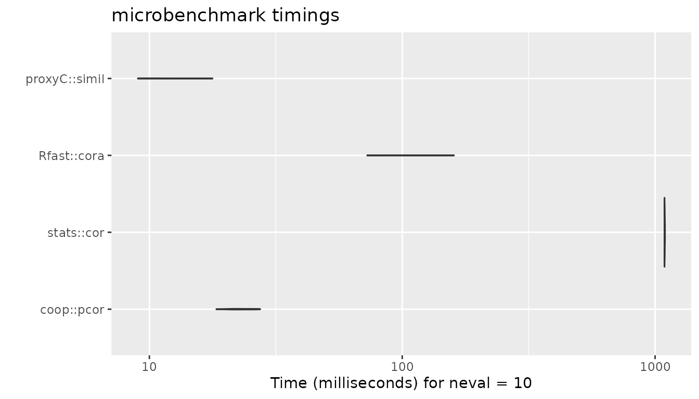
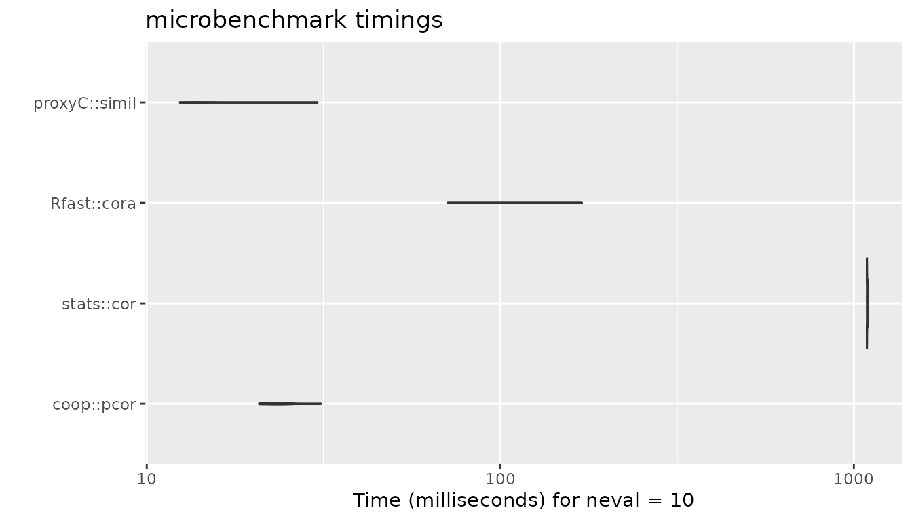

# Comparison of Execution Times

**proxyC** is optimized for computing proximity between rows or columns
of large sparse matrices.

In this vignette, we compare the execution times of **proxyC** with
other R packages for a variable sparsity level.

## Euclidean Distance

``` r
library(Matrix)
library(microbenchmark)
library(ggplot2)

n_rows <- 1000L
n_cols <- 1000L

# helper function to compute timings
compute_timings_for_euclidean <- function(
  n_rows = 1000L,
  n_cols = 1000L,
  density = 0.1,
  times = 10L
) {
  sparse_mat <- rsparsematrix(n_rows, n_cols, density)
  dense_mat <- as.matrix(sparse_mat)

  microbenchmark(
    # Disabled due to long execution times
    # "proxy::dist" = proxy::dist(dense_mat, method = "euclidean", diag = TRUE),
    "proxyC::dist" = proxyC::dist(sparse_mat, method = "euclidean", diag = TRUE),
    "Rfast::Dist" = Rfast::Dist(dense_mat, method = "euclidean"),
    "stats::dist" = dist(dense_mat, method = "euclidean"),
    "parallelDist::parDist" = parallelDist::parDist(dense_mat, method = "euclidean"),
    # Force conversion to matrix because distances::distances uses lazy evaluation
    "distances::distances" = as.matrix(distances::distances(dense_mat)),
    times = times
  )
}
```

### 1000 rows, 1000 columns, 95% sparsity

``` r
bm <- compute_timings_for_euclidean(n_rows = n_rows, n_cols = n_cols, density = 0.05)

autoplot(bm)
#> Warning: `aes_string()` was deprecated in ggplot2 3.0.0.
#> ℹ Please use tidy evaluation idioms with `aes()`.
#> ℹ See also `vignette("ggplot2-in-packages")` for more information.
#> ℹ The deprecated feature was likely used in the microbenchmark package.
#>   Please report the issue at
#>   <https://github.com/joshuaulrich/microbenchmark/issues/>.
#> This warning is displayed once every 8 hours.
#> Call `lifecycle::last_lifecycle_warnings()` to see where this warning was
#> generated.
```



### 1000 rows, 1000 columns, 50% sparsity

``` r
bm <- compute_timings_for_euclidean(n_rows = n_rows, n_cols = n_cols, density = 0.5)

autoplot(bm)
```



### 1000 rows, 1000 columns, 5% sparsity

``` r
bm <- compute_timings_for_euclidean(n_rows = n_rows, n_cols = n_cols, density = 0.95)

autoplot(bm)
```



## Pearson Correlation

``` r
n_rows <- 1000L
n_cols <- 1000L

# helper function to compute timings
compute_timings_for_correlation <- function(
  n_rows = 1000L,
  n_cols = 1000L,
  density = 0.1,
  times = 10L
) {
  sparse_mat <- rsparsematrix(n_rows, n_cols, density)
  dense_mat <- as.matrix(sparse_mat)

  microbenchmark(
    "coop::pcor" = coop::pcor(dense_mat),
    "stats::cor" = cor(dense_mat, method = "pearson"),
    "Rfast::cora" = Rfast::cora(dense_mat, large = TRUE),
    # Disabled due to long execution times
    # "proxy::simil" = proxy::simil(dense_mat, margin = 2, method = "correlation", diag = TRUE),
    "proxyC::simil" = proxyC::simil(sparse_mat, margin = 2, method = "correlation", diag = TRUE),
    times = times
  )
}
```

### 1000 rows, 1000 columns, 95% sparsity

``` r
bm <- compute_timings_for_correlation(n_rows = n_rows, n_cols = n_cols, density = 0.05)

autoplot(bm)
```



### 1000 rows, 1000 columns, 50% sparsity

``` r
bm <- compute_timings_for_correlation(n_rows = n_rows, n_cols = n_cols, density = 0.5)

autoplot(bm)
```



### 1000 rows, 1000 columns, 5% sparsity

``` r
bm <- compute_timings_for_correlation(n_rows = n_rows, n_cols = n_cols, density = 0.95)

autoplot(bm)
```


